# 🧠 Módulo 15: IA Avanzada y LangChain

n8n integra LangChain nativamente, permitiendo crear agentes autónomos y sistemas RAG.

## Contenido
1. **Conceptos Fundamentales**
   - **Model:** El cerebro (GPT-4, Claude, Llama).
   - **Chain:** Una secuencia lineal de acciones.
   - **Agent:** Un sistema que decide qué herramientas usar.
   - **Tool:** Funciones que el agente puede llamar (Calculadora, Google Search, API personalizada).
2. **Memoria (Memory)**
   - **Window Buffer:** Recuerda los últimos K mensajes.
   - **Redis/Postgres:** Memoria persistente entre sesiones.
3. **RAG (Retrieval Augmented Generation)**
   - Conectar tus propios datos (PDFs, Notion, SQL) a la IA.
   - **Vector Store:** Pinecone, Supabase, Qdrant.
   - **Embeddings:** Convertir texto a números (OpenAI Ada, Cohere).

## Arquitectura de un Agente RAG

```mermaid
graph LR
    A[Usuario] --> B(AI Agent Node);
    B --> C{¿Necesita Info?};
    C -- Sí --> D[Vector Store Tool];
    D --> E[(Pinecone/Supabase)];
    E --> D;
    D --> B;
    C -- No --> F[Responder Directo];
    B --> F;
```

### Ejemplo de Configuración de Memoria
Para que el bot recuerde tu nombre:
1. Usar nodo **AI Agent**.
2. Conectar sub-nodo **Window Buffer Memory**.
3. Configurar `Session ID` (usualmente viene del chat trigger, ej. `{{ $json.sessionId }}`).
